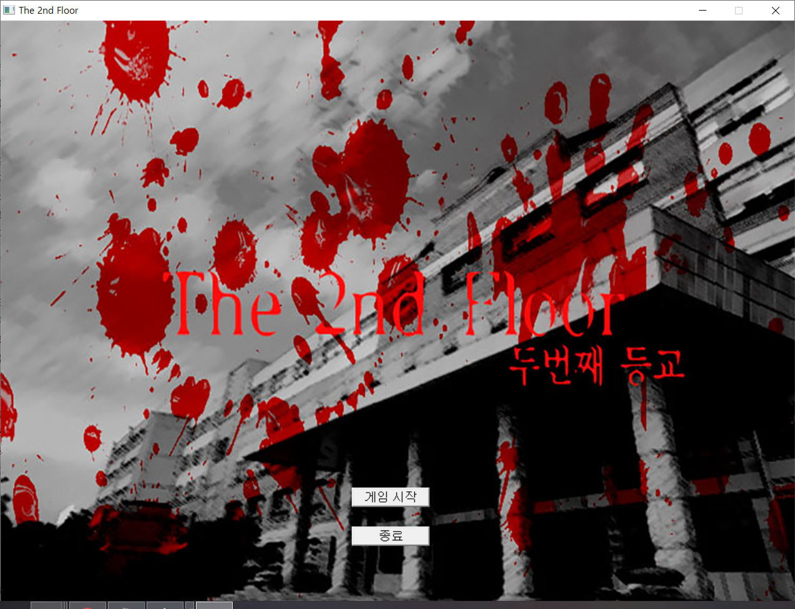
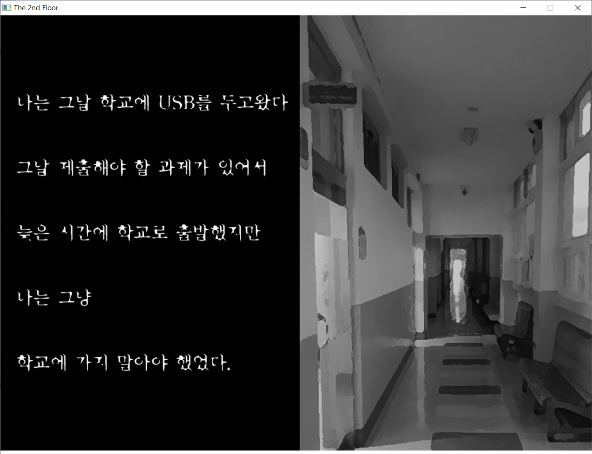
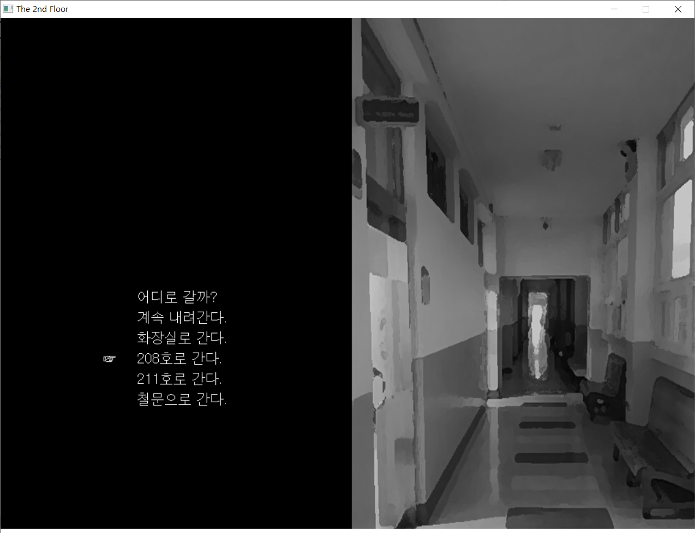
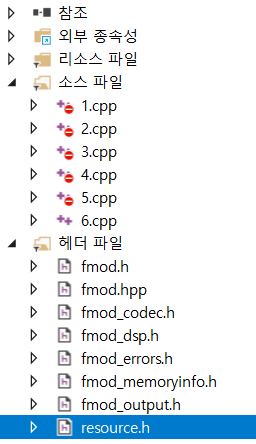

## 프로젝트명
The 2nd Floor  
(팀 프로젝트, 코딩 부분 전적 담당)
## 사용언어
C++
## 개발기간
2016.03 ~ 2016.06
## 프로젝트 소개
사용자가 게임 속 주인공이 되어 다음 상황을 선택하는 공포 게임
*****
## 스크린샷(플레이화면)
*****

*****
## 의존성

배경음 및 효과음 재생을 위해 FMOD 라이브러리 포함 필수

